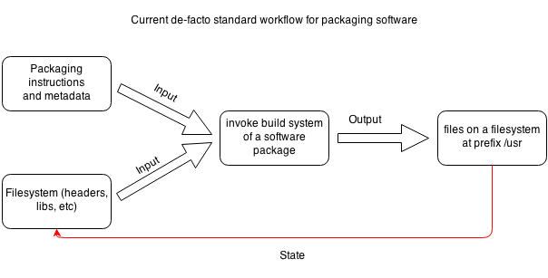
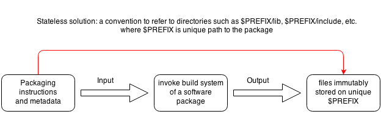

---
author:
- Periklis Tsirakidis
title: NixPkgs + OSX + Developer
---

# Nix &hearts; OSX &hearts; Dev

### Package management & Dev Environment

---

# What is NixOS & Nix in general?

----

## NixOS

- Declarative package and configuration management
- Reliable, atomic upgrades and rollbacks
- Reproducible and deterministic system configs
- Multi-user environments beyond system env

----

## Nix package manager

#### Stateful approach: brew/puppet/ansible/etc.

_(Source: "Why Puppet/Chef/Ansible aren't good enough" by Domen Kožar)_

----

## Nix package manager

#### Stateless approach: nixos

_(Source: "Why Puppet/Chef/Ansible aren't good enough" by Domen Kožar)_

----

## Nixpkgs repository

- Single repository for all packages
- Lazy evaluation of package expressions
- Overridable package expressions
- Rich library for customizations

----

## Stdenv Support

| OS      | i686     | x86_64   | arm5/6/7 |
| --------| -------- | -------- | -------- |
| Linux   | &#10003; | &#10003; | &#10003; |
| Darwin  |          | &#10003; |          |
| Solaris |          | &#10003; |          |
| FreeBSD |          | &#10003; |          |
| Cygwin  | &#10003; | &#10003; |          |

----

## Overview of the nix tools I

| Tool                | Function                         |
| ------------------- | -------------------------------- |
| nix-env             | Install, remove packages         |
| nix-shell           | Virtual development environment  |
| nix-build           | Testing & build expressions      |
| nix-repl            | REPL for testing nix expressions |

----

## Overview of the nix tools II

| Tool                | Function                                       |
| ------------------- | ---------------------------------------------- |
| nix-ops             | Deployment of nixos machines (AWS, Azure,etc.) |
| nix-channel         | Package channel management                     |
| nix-store           | Low level store management                     |
| nix-garbage-collect | Garbage collector                              |

---

## Demo 1: Let's play with the tools

---

## Demo 2: Explore nixpkgs repository

---

## Demo 3: Build default.nix for nix-shell in my project

---

## Demo 4: Patch/Enable a nix package expression

---

# So long and thanks for the fish!

Periklis Tsirakidis

Github: github.com/periklis

---

## Further reading

- [Nix Pills 1-19](http://nix-cookbook.readthedocs.io/en/latest/nix-pills.html)
- [Nix Manual](https://nixos.org/nixos/manual/)
- [NixPkgs Contributor's Guide](https://nixos.org/nixpkgs/manual/)
- [Nix Package Manager Guide](https://nixos.org/nix/manual/)
- [Nix Publications](https://nixos.org/~eelco/pubs/)
- [Why Puppet/Chef/Ansible aren't good enough](https://www.domenkozar.com/2014/03/11/why-puppet-chef-ansible-arent-good-enough-and-we-can-do-better/)
- [From Zero to Application Delivery with NixOS](https://www.infoq.com/presentations/nixos)
- [Tour on Nix Lang](https://nixcloud.io/tour/?id=1)
- [User report: How i develop with nix](https://ocharles.org.uk/blog/posts/2014-02-04-how-i-develop-with-nixos.html)
- [User report Nix for Pythoneers](http://datakurre.pandala.org/2015/10/nix-for-python-developers.html)
