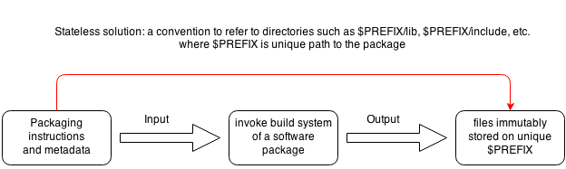

---
author:
- Periklis Tsirakidis
title: Nix for Developers
---

# Nix for Developers

---

## Topics

- Short overview of the Nix Ecosystem
- What can I use Nix for?
- How can I manage (own) packages?
- How can I handle my development environment?
- Clear boundaries between Nix, docker, puppet, $tool
- Q/A

---

## Orientation

- Any Puppeteers?
- Any Chefs ?
- Any Ansibleists?
- Any Docker-Boys?

---

# What is Nix?

----

## Nix

- Declarative package and configuration management
- Reliable, atomic upgrades and rollbacks
- Reproducible and deterministic system configs
- Multi-user environments beyond system only

----

## The ecosystem

| Name    | Description |
| ------- | ------------ |
| Nix     | The package manager |
| Nix     | The nix language |
| Nixpkgs | The official package registry/repository |
| NixOS   | The linux distribution on Nix & NixPkgs |
| NixOS   | The open source project in general |
| NixOps  | The NixOs Cloud Deployment Tool |

----

## Nix package manager

#### Stateful approach: brew/puppet/ansible/etc.


_(Source: "Why Puppet/Chef/Ansible aren't good enough" by Domen Kožar)_

----

## Nix package manager

#### Stateless approach: nixos



_(Source: "Why Puppet/Chef/Ansible aren't good enough" by Domen Kožar)_

----

## Nixpkgs repository

- Single repository for all packages
- Lazy evaluation of package expressions
- Overridable package expressions
- Rich library for customizations

----

## Stdenv Support

| OS      | i686     | x86_64   | arm5/6/7 |
| --------| -------- | -------- | -------- |
| Linux   | &#10003; | &#10003; | &#10003; |
| Darwin  |          | &#10003; |          |
| Solaris |          | &#10003; |          |
| FreeBSD |          | &#10003; |          |
| Cygwin  | &#10003; | &#10003; |          |

----

## Overview of the nix tools I

| Tool                | Function                         |
| ------------------- | -------------------------------- |
| nix-env             | Install, remove packages         |
| nix-shell           | Virtual development environment  |
| nix-build           | Testing & build expressions      |
| nix-repl            | REPL for testing nix expressions |

----

## Overview of the nix tools II

| Tool                | Function                                       |
| ------------------- | ---------------------------------------------- |
| nix-ops             | Deployment of nixos machines (AWS, Azure,etc.) |
| nix-channel         | Package channel management                     |
| nix-store           | Low level store management                     |
| nix-garbage-collect | Garbage collector                              |

---

## How to start using Nix?

```bash
$ curl https://nixos.org/nix/install | sh
$ nix-channel --add https://nixos.org/channels/nixos-17.09
$ nix-channel --update
```

_Follow the instructions during install for your shell!_

_Consider [official instructions](https://nixos.org/nix/download.html) and the manual for further explanation on [installation modes](https://nixos.org/nix/manual/#ch-nix-security)_

---

## Daily job: Manage my packages

Search for a package

```bash
$ nix-env -qaP '.*hello.*'
```

Install a package

```bash
$ nix-env -iA hello

```
Remove a package

```bash
$ nix-env -e hello
```

----

### Take away tips

- Use attribute paths instead of package names
- Locate attributes paths in [top-level/all-packages.nix](https://github.com/NixOS/nixpkgs/blob/master/pkgs/top-level/all-packages.nix)
- Remove does only **unlink** from your user profile
- For total remove use the garbage collector

---

## Daily job: Use nix-shell in my project

- Share local env vars across team ***w/o*** friction
- Pin build inputs across team ***w/o*** local dirty states
- Share build instructions as code ***NOT*** as `README.md`
- Share local company patches not in Nixpkgs
- Debug the build process phase by phase

----

```nix
{
  # The Derivation Argument List
  pkgs ? import <nixpkgs> {}
, rev ? "HEAD"
, nodeEnv ? "development"
}:
# Your local defines/overides/patches in here
let
  inherit(pkgs) stdenv lib;
in
#  Your target derivation
stdenv.mkDerivation rec {

  name = "THE-DERIVATION";
  version = "0.1";

  shellHook = ''
    echo "--- Your shell startup code here ---"
  '';

  meta = {
    description = "Short description about your derivation ";
    longDescription = ''
      Long description about your derivation
    '';
    license = stdenv.lib.licenses.unfree;  # Enter a licence here
    maintainers = [ stdenv.lib.maintainers.periklis ]; # Your maintainer name for GH-PR
    platforms = with stdenv.lib.platforms; [ unix ]; # Define your target platforms
  };
}
```

----

### Take away tips

- Nix shell expects a function returning a derivation
- Pin your Nixpkgs channel in the derivation arg list
- Minimal derivation inputs: `name`, `version`, `src`
- Make use of the official [library](https://github.com/NixOS/nixpkgs/tree/master/lib) and [build-suppport](https://github.com/NixOS/nixpkgs/tree/master/pkgs/build-support)
- Consider the manual on [Standard Environment](https://nixos.org/nixpkgs/manual/#chap-stdenv)
- Distribute `default.nix` in your repository

---

## Daily job: Manage project packages

- Use Package overrides (See [manual](https://nixos.org/nixpkgs/manual/#chap-packageconfig))
- Use Nixpkgs Overlays (See [manual](https://nixos.org/nixpkgs/manual/#chap-overlays))
- Use your company's `nixpkgs` repository fork, e.g. [nixpkgs@mayflower](https://github.com/mayflower/nixpkgs)
- Use your company's `nixpkgs` overlay repository, e.g. [nixpkgs@HC](https://github.hc.ag/hc-nix/hc-nixpkgs/)

---

# So long and thanks for the fish!

Periklis Tsirakidis

Github: [github.com/periklis](https://github.com/periklis)

Slides: [periklis.github.io/talks](https://periklis.github.io/talks/)

---

## Interested?

Ask irc.freenode: #nixos

Enter company slack channel: [#nix && #cop-nix](holidaycheck.slack.com)

Cross-Company CoP NixOS: [copnixos.slack.com](https://copnixos.slack.com)

---

## Further reading

- [Nix Pills 1-19](http://nix-cookbook.readthedocs.io/en/latest/nix-pills.html)
- [Nix Manual](https://nixos.org/nixos/manual/)
- [NixPkgs Contributor's Guide](https://nixos.org/nixpkgs/manual/)
- [Nix Package Manager Guide](https://nixos.org/nix/manual/)
- [Nix Publications](https://nixos.org/~eelco/pubs/)
- [NixOS.wiki Bookmarks](https://nixos.wiki/wiki/Bookmarks)
- [Nix-Shell Workshop](https://github.com/nixcloud/nix-shell-workshop)

---

- [Why Puppet/Chef/Ansible aren't good enough](https://www.domenkozar.com/2014/03/11/why-puppet-chef-ansible-arent-good-enough-and-we-can-do-better/)
- [Nix vs. Linux Standard Base](https://nixos.wiki/wiki/Nix_vs._Linux_Standard_Base)
- [From Zero to Application Delivery with NixOS](https://www.infoq.com/presentations/nixos)
- [Tour on Nix Lang](https://nixcloud.io/tour/?id=1)
- [User report: How i develop with nix](https://ocharles.org.uk/blog/posts/2014-02-04-how-i-develop-with-nixos.html)
- [User report Nix for Pythoneers](http://datakurre.pandala.org/2015/10/nix-for-python-developers.html)
